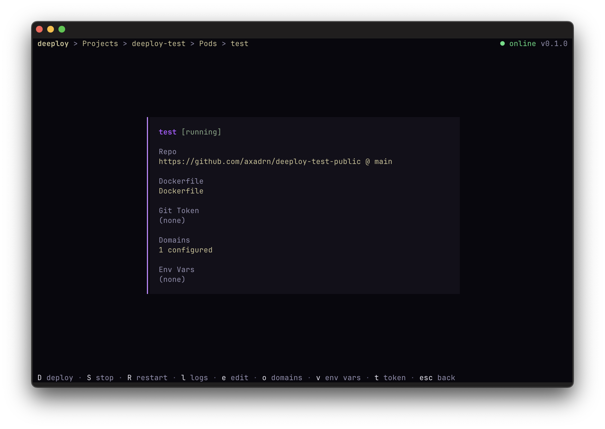

# deeploy

Modern Deployment. Terminal First. Open Source.



## Quick Start

**Server (VPS)**

```bash
curl -fsSL https://deeploy.sh/server.sh | sudo bash
```

**TUI (your machine)**

```bash
curl -fsSL https://deeploy.sh/tui.sh | bash
```

## Documentation

[deeploy.sh/docs](https://deeploy.sh/docs)

## Development

```bash
task dev:server             # Server (SQLite as default)
task dev:server:postgres    # Server (PostgreSQL - confirgure .env)
task dev:tui                # TUI client
task dev:docs               # Docs website
```

For PostgreSQL, set `DB_DRIVER=pgx` in `.env`.

```bash

```

## License

[Apache 2.0](LICENSE)
